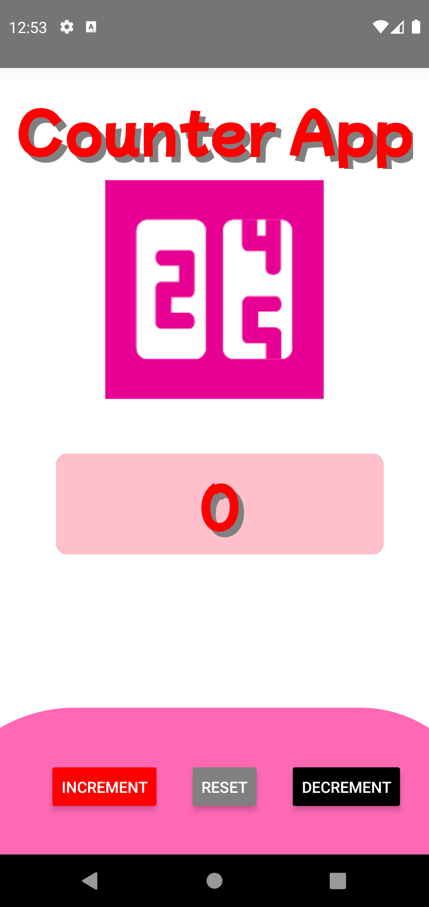
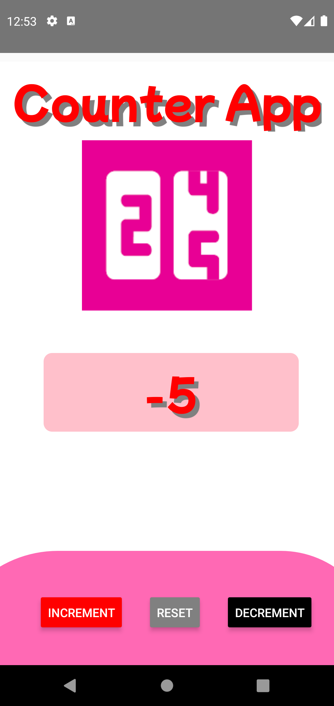

# CounterApp-Android
By:V.S.Sai Rashwant 20BCE1332

Home Screen:
1. Basic UI:

 

2. Increment:
   When we click on the increment button the number increases by 1.
 
 
 
 
 
 
  
  
  
2. Decrement:
   When we click on the increment button the number decreases by 1.
 
 
 
 
 
 
  

3. Reset:
    When we click on reset button the value is set to 0.
    
    
    
    
    

 
